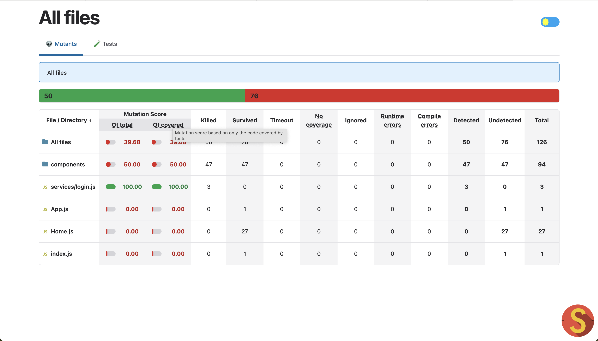

# AcademIQ

AcademIQ is a comprehensive Educational Salary Disbursement (ESD) platform designed to provide faculty members with a streamlined view of their salary history. This project enables faculty to securely log in, access their salary details, view disbursement history, and download specific month-wise salary slips.  

---

## Features  

### Faculty View Salary History  

- **Secure Authentication**  
  Faculty members must log in using JWT-based authentication to access their personalized salary information securely.  

- **Salary Display**  
  View current salary details immediately after logging in.  

- **Salary Disbursement History**  
  Gain insights into past payments with access to a comprehensive history of all salary disbursements.  

- **Download Salary Slips**  
  Faculty can download month-wise salary slips for records or reference.  

### Testing and Quality Assurance  

- **Unit Testing**  
  Comprehensive unit test cases were designed and implemented for all components of the system to ensure robust functionality and reliability.  

- **Mutation Testing**  
  Integrated **Stryker** for mutation testing to evaluate the effectiveness of unit tests and improve code quality.  
  - Stryker automatically introduces small code changes (mutations) to test if existing unit tests can detect them.  
  - Achieved a high mutation score, demonstrating the robustness of the test suite.  

- **Bypass Testing**  
  Performed bypass testing to identify any potential vulnerabilities in authentication mechanisms, ensuring that unauthorized users cannot gain access to faculty salary details.  

  Below is a screenshot of the mutation score achieved using Stryker:  

  

---

## Tech Stack  

- **Backend**: Java Spring Boot  
- **Frontend**: ReactJS  
- **Authentication**: JSON Web Token (JWT)  

---

## Team  

### Vicky Panchal  
- **Roll Number**: MT2023098  
- **Role**: Backend Development  
  - Developed the backend system.  
  - Designed and implemented APIs.  

### Adarsh Tripathi  
- **Roll Number**: MT2023110  
- **Role**: Frontend Development  
  - Developed the user interface and integrated backend APIs.  

---

## Setup  

### Prerequisites  

1. **Backend**  
   - Install [Java JDK 17](https://www.oracle.com/java/technologies/javase-jdk17-downloads.html).  
   - Install [Maven](https://maven.apache.org/install.html).  

2. **Frontend**  
   - Install [Node.js](https://nodejs.org/).  

---

### Installation  

#### Backend  

1. Clone the repository:  
   ```bash
   git clone <repository-link>
   cd AcademIQ/backend
   ```  

2. Build and run the Spring Boot application:  
   ```bash
   mvn clean install
   mvn spring-boot:run
   ```  

#### Frontend  

1. Navigate to the `frontend` folder:  
   ```bash
   cd ../frontend
   ```  

2. Install dependencies and start the React app:  
   ```bash
   npm install
   npm start
   ```  

---

## Usage  

1. Launch the backend server.  
2. Start the frontend application.  
3. Open the web application in your browser at `http://localhost:3000`.  
4. Log in with faculty credentials to access the salary details.  

---

## Testing  

1. **Run Unit Tests**  
   Navigate to the backend or frontend directories and execute:  
   ```bash
   mvn test # For backend  
   npm test # For frontend
   ```  

2. **Run Mutation Tests**  
   Run mutation testing with Stryker:  
   ```bash
   npx stryker run
   ```  

3. **Bypass Testing**  
   Verified the security of authentication mechanisms to ensure protection against unauthorized access.  

---

## Contribution  

If you'd like to contribute, please fork the repository and submit a pull request. For major changes, open an issue first to discuss your proposed changes.  

---

## License  

This project is licensed under the MIT License. See the LICENSE file for details.  
